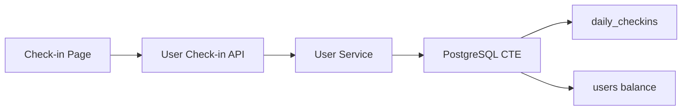

# Daily Check-in

Feature Name: daily-check-in
Updated: 2026-07-31

## Description

每日签到通过独立记录表与用户余额原子更新发放固定 0.20 美元奖励。

## Architecture

## Data Models

`daily_checkins` 使用 `(user_id, checkin_date)` 唯一约束保证每个签到日只会创建一条记录。

## Correctness Properties

签到记录插入和余额更新在同一 SQL 语句中完成。唯一约束使并发请求中只有一个请求获得奖励。

## Error Handling

认证中间件验证用户身份。数据库错误通过现有统一错误响应返回。

## Test Strategy

覆盖首次领取、重复领取、余额返回和并发唯一约束。
